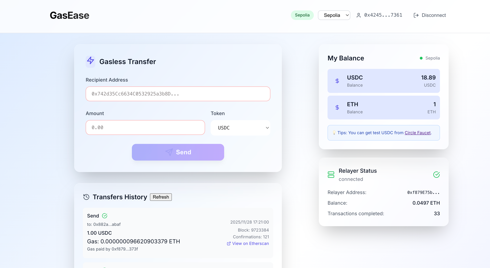
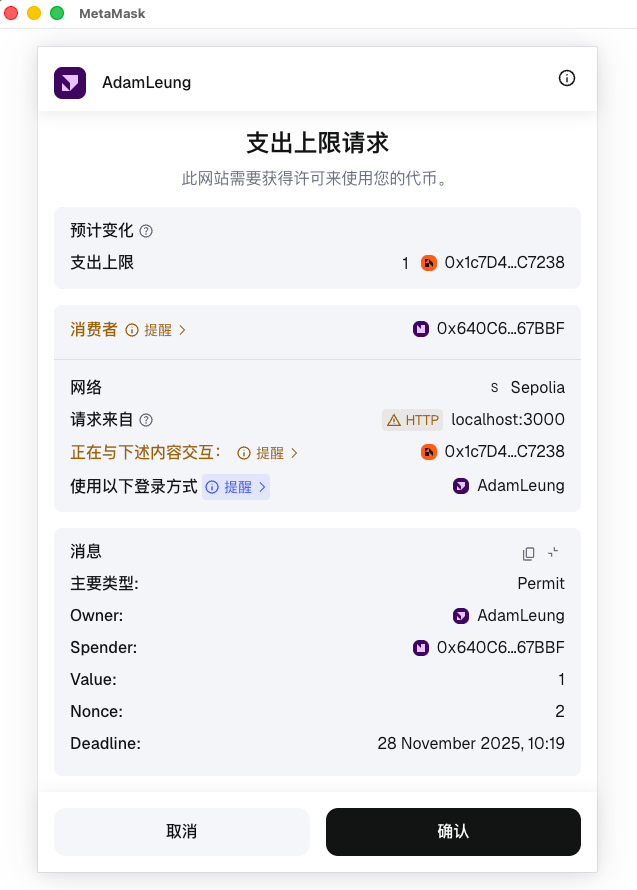
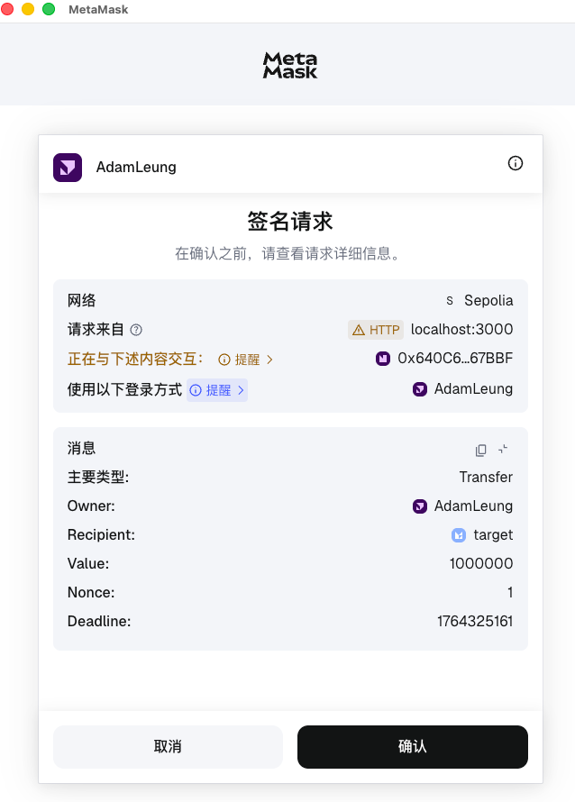
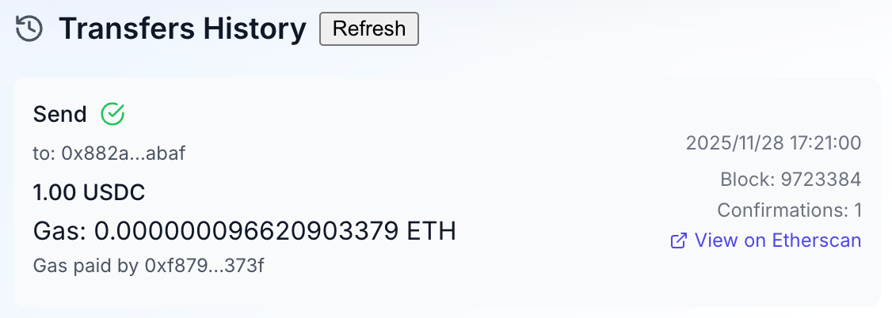

# GasEase

A gasless transfer system that allows users to transfer USDC without owning ETH, built on Sepolia Testnet and applied on Metamask.



## Step 1

Modify .env files in both frontend and backend.

```shell
PORT=3001
NODE_ENV=development
# Sepolia测试网 - 使用Infura
RPC_URL=https://sepolia.infura.io/v3/3b892aaaa19a44dd9a1fabd76b513bc2

# 中继器私钥（用于代付Gas）
# 生成测试私钥：
# 1. 使用MetaMask创建新账户并导出私钥
# 2. 确保该账户有足够的ETH支付Gas费
RELAYER_PRIVATE_KEY=...

GASLESS_TRANSFER_CONTRACT_ADDRESS=0x640C6aD60C2824B02766660522580C3FECa67BBF
```

```shell
# 区块链网络配置
VITE_SEPOLIA_RPC_URL=https://sepolia.infura.io/v3/3b892aaaa19a44dd9a1fabd76b513bc2

# 中继服务配置
VITE_RELAY_API_URL=http://localhost:3001/api

# 合约地址
VITE_USDC_TOKEN_ADDRESS=0x1c7D4B196Cb0C7B01d743Fbc6116a902379C7238
VITE_GASLESS_TRANSFER_CONTRACT_ADDRESS=0x640C6aD60C2824B02766660522580C3FECa67BBF
# Etherscan APIKEY, 你需要自己创建并导入
VITE_ETHERSCAN_API_KEY=...
```

## Step 2

```shell
cd frontend
npm install
npm run dev
```

```shell
cd backend
npm install
npm run dev
```

Open http://localhost:3000/ for frontend and http://localhost:3001/ for backend.

## Step 3

Input recipient address and amount, then click "Send" button to send USDC gasless. You need to sign twice and waiting for 10 secs.

|  |  |
| ------ | :----- |

You can track your transfer history and check your receipts.




